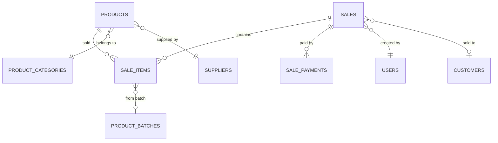

# 🗄️ Arquitetura do Banco de Dados - ERP Pet Shop

**Gerado em:** 27/11/2025  
**Fonte:** Consulta direta ao banco PostgreSQL via `information_schema`

---

## 📊 Visão Geral

**Total de tabelas:** 34  
**Total de views:** 3 (`v_current_stock`, `v_daily_financial_summary`, `v_top_selling_products`)

---

## 📋 Tabelas Existentes

### Produtos e Estoque
- `products` - Cadastro de produtos (33 colunas)
- `product_categories` - Categorias de produtos
- `product_batches` - Lotes (para rastreabilidade)
- `product_stock` - Controle de estoque por localização
- `stock_locations` - Locais de armazenamento
- `stock_movements` - **✅ Histórico de movimentações** (JÁ EXISTE!)

### Vendas
- `sales` - Cabeçalho de vendas (26 colunas)
- `sale_items` - Itens vendidos (15 colunas)
- `sale_payments` - Formas de pagamento (16 colunas - suporta múltiplos pagamentos!)

### Compras (Aparentemente não implementado ainda)
- Não existem tabelas de compras/pedidos de compra

### Clientes e Fornecedores
- `customers` - Clientes
- `pets` - Pets dos clientes
- `suppliers` - Fornecedores
- `loyalty_transactions` - Programa de fidelidade

### Financeiro
- `financial_transactions` - Transações financeiras
- `bank_accounts` - Contas bancárias
- `bank_reconciliations` - Conciliação bancária
- `cash_registers` - Caixas
- `cash_movements` - Movimentações de caixa
- `chart_of_accounts` - Plano de contas
- `cost_centers` - Centros de custo

### Fiscal
- `invoices` - Notas fiscais
- `invoice_series` - Séries de notas
- `digital_certificates` - Certificados digitais A1/A3

### Sistema
- `users` - Usuários do sistema
- `user_sessions` - Sessões de usuários
- `pdv_terminals` - Terminais PDV
- `audit_logs` - Logs de auditoria
- `company_settings` - Configurações da empresa
- `system_settings` - Configurações do sistema

### Orçamentos
- `quotes` - Orçamentos
- `quote_items` - Itens de orçamentos

---

## 🔑 Tabelas Principais Detalhadas

### `products` (33 colunas)

**Identificação:**
- `id` UUID [NOT NULL]
- `name` VARCHAR [NOT NULL]
- `description` TEXT
- `brand` VARCHAR
- `internal_code` VARCHAR
- `ean` VARCHAR (código de barras)
- `sku` VARCHAR

**Categorização:**
- `category_id` UUID → FK para `product_categories`
- `supplier_id` UUID → FK para `suppliers`

**Precificação e Custos:**
- `cost_price` NUMERIC [NOT NULL]
- `sale_price` NUMERIC [NOT NULL]
- `profit_margin` NUMERIC ✅ **JÁ EXISTE!**
- ⚠️ **FALTAM:** `last_cost`, `average_cost`

**Estoque:**
- `stock_quantity` NUMERIC
- `min_stock` NUMERIC
- `max_stock` NUMERIC
- `unit` VARCHAR (UN, KG, L, etc)

**Especiais:**
- `is_bulk` BOOLEAN (venda a granel)
- `parent_product_id` UUID (produtos filhos)
- `conversion_factor` NUMERIC (conversões UN ↔ KG)
- `is_perishable` BOOLEAN
- `shelf_life_days` INTEGER
- `track_by_batch` BOOLEAN

**Fiscal:**
- `ncm` VARCHAR (Nomenclatura Comum do Mercosul)
- `cest` VARCHAR (Código Especificador da Substituição Tributária)
- `cfop` VARCHAR (Código Fiscal de Operações)
- `icms_rate` NUMERIC
- `ipi_rate` NUMERIC
- `pis_rate` NUMERIC
- `cofins_rate` NUMERIC

**Outros:**
- `image_url` TEXT
- `is_active` BOOLEAN
- `created_at` TIMESTAMPTZ
- `updated_at` TIMESTAMPTZ

---

### `sales` (26 colunas)

**Identificação:**
- `id` UUID [NOT NULL]
- `sale_number` VARCHAR [NOT NULL] (único)

**Relacionamentos:**
- `terminal_id` UUID → FK para `pdv_terminals`
- `cash_register_id` UUID → FK para `cash_registers`
- `customer_id` UUID → FK para `customers`
- `user_id` UUID [NOT NULL] → FK para `users`

**Valores:**
- `subtotal` NUMERIC [NOT NULL]
- `discount` NUMERIC
- `total` NUMERIC [NOT NULL]

**Status:**
- `status` VARCHAR (completed, cancelled)
- `cancelled_reason` TEXT
- `cancelled_by` UUID
- `cancelled_at` TIMESTAMP

**Nota Fiscal:**
- `invoice_type` VARCHAR (NFCe, NFe, etc)
- `invoice_number` VARCHAR
- `invoice_series` VARCHAR
- `invoice_key` VARCHAR (chave de acesso 44 dígitos)
- `invoice_xml_path` TEXT
- `invoice_pdf_path` TEXT
- `invoice_issued_at` TIMESTAMP

**Sincronização:**
- `synced` BOOLEAN
- `sync_errors` TEXT

**Fidelidade:**
- `loyalty_points_earned` INTEGER
- `loyalty_points_redeemed` INTEGER

**Auditoria:**
- `created_at` TIMESTAMPTZ ✅ **COM TIMEZONE!**
- `updated_at` TIMESTAMPTZ

---

### `sale_items` (15 colunas)

- `id` UUID [NOT NULL]
- `sale_id` UUID [NOT NULL] → FK
- `product_id` UUID [NOT NULL] → FK
- `batch_id` UUID → FK (rastreabilidade)
- `quantity` NUMERIC [NOT NULL]
- `unit_price` NUMERIC [NOT NULL]
- `cost_price` NUMERIC ✅ **Registra custo no momento da venda!**
- `discount` NUMERIC
- `total` NUMERIC [NOT NULL]
- `weight` NUMERIC (para produtos a granel)
- `barcode_generated` VARCHAR (código gerado no PDV)
- `deleted_at` TIMESTAMP (soft delete)
- `deleted_by` UUID
- `deletion_reason` TEXT
- `created_at` TIMESTAMPTZ

---

### `sale_payments` (16 colunas)

**✅ Suporta MÚLTIPLOS PAGAMENTOS por venda!**

- `id` UUID [NOT NULL]
- `sale_id` UUID [NOT NULL] → FK
- `payment_method` VARCHAR [NOT NULL] (cash, debit_card, credit_card, pix)
- `amount` NUMERIC [NOT NULL]

**Cartão:**
- `card_brand` VARCHAR (Visa, Master, Elo)
- `card_last_digits` VARCHAR (últimos 4 dígitos)
- `installments` INTEGER
- `authorization_code` VARCHAR

**PIX:**
- `pix_qrcode` TEXT
- `pix_txid` VARCHAR
- `pix_e2eid` VARCHAR
- `pix_status` VARCHAR (pending, confirmed, expired)
- `pix_confirmed_at` TIMESTAMP

**Dinheiro:**
- `change_amount` NUMERIC (troco)

**Outros:**
- `notes` TEXT
- `created_at` TIMESTAMPTZ

---

### `stock_movements` ✅ **JÁ EXISTE!**

**⚠️ IMPORTANTE:** Precisa consultar colunas exatas! Mas a tabela já está criada.

Provável estrutura:
- `id` UUID
- `product_id` UUID → FK
- `movement_type` VARCHAR ('in', 'out', 'adjustment')
- `quantity` INTEGER
- `reference_type` VARCHAR ('sale', 'purchase', 'adjustment')
- `reference_id` UUID
- `created_at` TIMESTAMPTZ

---

## 🔗 Relacionamentos Principais



---

## 💡 Lógica de Negócio Implementada

### 1. Venda Completa

**Fluxo:**
1. Criar registro em `sales` (subtotal, discount, total)
2. Para cada produto:
   - Inserir em `sale_items` (quantity, unit_price, **cost_price**)
   - **Abater estoque:** `UPDATE products SET stock_quantity = stock_quantity - quantity`
3. Para cada forma de pagamento:
   - Inserir em `sale_payments` (payment_method, amount)
4. Registrar em `stock_movements` (tipo 'out')

**✅ Implementado:** Backend `POST /api/sales` com transação atômica

---

### 2. Cancelamento de Venda

**Fluxo:**
1. Marcar venda: `UPDATE sales SET status='cancelled', cancelled_reason=?, cancelled_at=NOW()`
2. **Estornar estoque:** Para cada item, `UPDATE products SET stock_quantity = stock_quantity + quantity`
3. Registrar em `audit_logs`

**⚠️ Pendente:** Endpoint `POST /api/sales/:id/cancel`

---

### 3. Entrada de Estoque (A IMPLEMENTAR)

**Fluxo proposto:**
1. Usuário lança entrada (manual ou via NF-e)
2. Para cada produto:
   - Calcular **novo custo médio ponderado:**
     ```
     new_avg_cost = (
       (stock_quantity * average_cost) + (entrada_qty * entrada_cost)
     ) / (stock_quantity + entrada_qty)
     ```
   - Verificar **margem:**
     ```
     margin = ((sale_price - new_avg_cost) / sale_price) * 100
     ```
   - Se `margin < profit_margin` → alertar usuário
3. Confirmar entrada:
   - `UPDATE products SET stock_quantity += qty, last_cost = ?, average_cost = ?`
   - Registrar em `stock_movements` (tipo 'in')

---

## 🚧 Campos a Adicionar

### `products`

```sql
ALTER TABLE products 
ADD COLUMN last_cost NUMERIC DEFAULT 0,
ADD COLUMN average_cost NUMERIC DEFAULT 0;
```

**Motivo:**
- `last_cost` - Custo da última nota (precificação futura)
- `average_cost` - Custo médio ponderado (DRE/lucro real)

---

## 📊 Views Existentes

### `v_current_stock`
Provavelmente: `SELECT product_id, SUM(quantity) FROM stock_movements GROUP BY product_id`

### `v_daily_financial_summary`
Resumo financeiro diário (vendas, custos, lucro)

### `v_top_selling_products`
Top produtos mais vendidos

**⚠️ TODO:** Consultar definição exata dessas views

---

## 📝 Próximos Passos

1. ✅ Documentação criada
2. ⚠️ Consultar colunas de `stock_movements` (via SQL)
3. ⚠️ Adicionar `last_cost` e `average_cost` em `products`
4. ⚠️ Implementar entrada de estoque usando `stock_movements`
5. ⚠️ Criar tabela `purchase_orders` (futuramente, para pedidos de compra)
6. ⚠️ Consultar definição das views

---

**💾 Este documento será atualizado conforme sistema evolui.**
